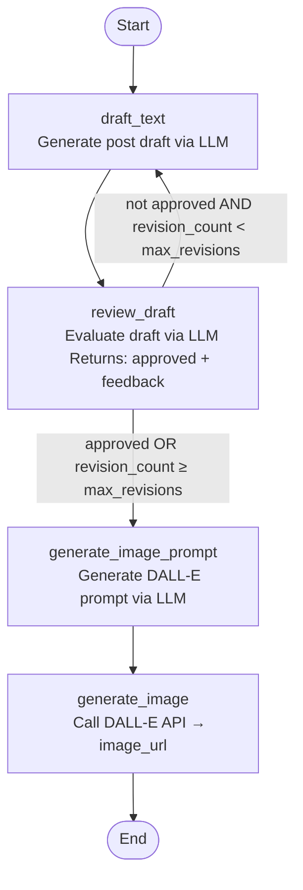

# Post Generation Graph

The agent uses a LangGraph state machine to draft, review, and illustrate a social media post.

## Flow

## State

| Field | Type | Description |
|---|---|---|
| `messages` | `list[AnyMessage]` | Accumulated LLM message history |
| `draft_text` | `str` | Current post draft |
| `approved` | `bool` | Whether the reviewer approved the draft |
| `review_feedback` | `str` | Reviewer's feedback for the next revision |
| `revision_count` | `int` | Number of review iterations so far |
| `image_prompt` | `str` | DALL-E prompt generated from the approved draft |
| `image_url` | `str \| None` | URL of the generated image |
| `llm_calls` | `int` | Total LLM invocations (observability) |

## Nodes

| Node | Description |
|---|---|
| `draft_text` | Calls ChatOpenAI to write a social media post from the user's input |
| `review_draft` | Calls ChatOpenAI with structured output to approve or reject the draft with feedback |
| `generate_image_prompt` | Calls ChatOpenAI to write a vivid DALL-E-compatible image description |
| `generate_image` | Calls the OpenAI images API (DALL-E) and writes the result URL to state |

## Routing

After `review_draft`, the `should_continue` router decides the next node:

- **Advance** → `generate_image_prompt` when `approved is True` or `revision_count >= max_revisions`
- **Loop** → `draft_text` otherwise

`max_revisions` defaults to `3`, acting as an escape hatch to prevent infinite revision loops.
